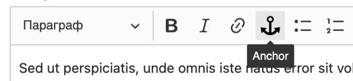
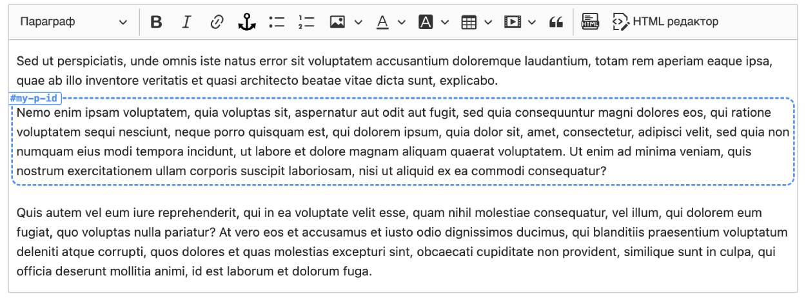

# CKEditor 5 Anchor ID Plugin

Plugin for adding anchor IDs to content in CKEditor 5.

## Installation

```
npm install ckeditor5-anchor-id --save-dev
```

## Usage

```
import AnchorIdPlugin from 'ckeditor5-anchor-id';

Editor.builtinPlugins = [
  ...,
  AnchorIdPlugin
]

const editorConfig = {
  ...,
  toolbar: {
    ...,
    items: [
      ...,
      "anchorId"
    ]
  }
}
```

## Examples





## License

MIT